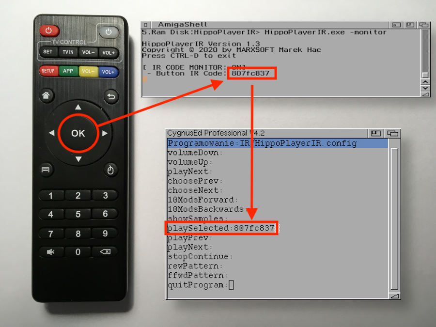
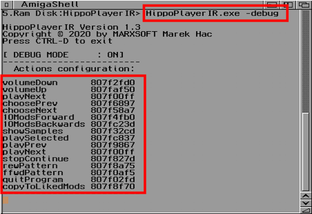

# HippoPlayerIR
<sub>Copyright © 2019 by MARXSOFT Marek Hać</sub>

### Introduction
Does anybody need a remote controlled Amiga computer these days? Not at all, so... let’s do it! :). 

In this simple project you will learn how to connect wireless IR receiver with Amiga and how to control HippoPlayer while listening to music modules. If you want to see how it works, take a look at this video:

[](http://www.youtube.com/watch?v=R4ydfs7XyGg)

Cool, isn’t it ? So let’s take a deep dive into the world of infrared light and... Amiga

### Features
Basically, we end up with wirelessly controlled HippoPlayer using IR remote controller.
You will be able to...

* control volume level
* choose specific module from the playlist 
* play selected module
* play next/previous module
* jump 10 modules forward/backwards on playlist
* show/hide sample window
* stop/continue playing module
* rew/ffwd pattern of the module

### Gathering the parts

* Arduino Nano ATMEGA328P
* Mini RS232 MAX3232 Level to TTL Converter 
* Wireless IR Receiver Module (KY-005)
* Any IR Remote Controller (the one taken from cheap Android TV would be perfect)
* DB25 female plug
* AMIGAAAAAA!!!

### Software

* Amiga with OS version 2.0 or higher
* RexxMast (tested with version 1.15). It’s a good idea to place it in WBStartup
* HippoPlayer (tested with latest version 2.45)
* HippoPlayerIR

### How it works
The "chain reaction" looks like this:


1. Press the button on the remote controller
2. Remote controller sends modulated IR signal to the Wireless IR Receiver Module
3. Wireless IR Receiver Module sends binary signal to Arduino
4. Arduino decodes received data as a specific IR Key Code
5. Arduino sends IR Key Code (in TTL standard) to MAX3232 module
6. MAX3232 Module convert data from TTL to RS 232 standard and send it to Amiga
7. Amiga listening on serial port and waiting for IR Key Code to arrive
8. When IR Key Code arrive on serial port, Amiga analyze it and run proper ARexx script to perform some specific action on HippoPlayer (fe. play, next, stop ...) 

### Theory and wiring everything up

The key thing is the connection between Arduino and Amiga. Arduino uses serial communication called TTL, which remain between the limits of 0V and Vcc. A logic high state (1) is represented by 5V or 3.3 V, while a logic low (0) is 0V. On the other hand Amiga had serial port which complies with the RS-232 standard. Logic “high” state (1) is represented by a negative value (between -3 V to -25V), while a logic “low” state (0) by a positive voltage between +3 V to +25 V. On Amiga, it’s a range of signals between -12 V and +12V.

So basically there are two things we need to deal with:

* signals need to be inverted 
* voltage needs to be regulated to not harm Arduino serial pins

It looks like the Arduino and Amiga talks with completely different languages. To convert signals from TTL to RS232 standard, we will use MAX3232 chip module. This way Arduino will be able to send data to Amiga serial port, and Amiga will be able to understand the language in which Arduino is talking to her. On the other hand, if Amiga would like to say something to Arduino, she will not immediately smash Arduino’s serial pins (what a tough girl ;). OK, so let’s wire Arduino via MAX3232 module with DB25 female plug.


After we setup a healthy partnership between Arduino and Amiga, we need to connect the Wireless IR Receiver Module with Arduino. It’s powered by +5V (taken from Arduino board), and send IR modulated signals by “S” pin connected with D7 pin on Arduino board.

Generally (from the hardware point of view) this is it. Arduino can be powered by build-in mini-b usb connector or by external power source (connected to +5V and GND). You can now upload...

### Arduino code

It’s very simple. We setup digital pin 7 on Arduino as a receiver for IR modulated signals. Then we set serial data transmission speed to 9600 baud, and start to listening for incoming IR codes. When we catch something, we filter it to drop all long pressed key codes (0xFFFFFFFF). At the end we convert IR Key Codes as a HEX value to String and send it with NULL character to Amiga. 

>**NOTE:** String termination (0x0) is important, because Amiga will didn’t know when to stop fetching data from serial port.

```
#include <IRremote.h>

const int RECV_PIN = 7;
IRrecv irrecv(RECV_PIN); 
decode_results results;
String code;

void setup(){
  Serial.begin(9600);
  irrecv.enableIRIn();
  irrecv.blink13(true); // blink on button press
}

void loop(){
    if (irrecv.decode(&results)){
        if (results.value != 0xFFFFFFFF) {
      
          code = String(results.value, HEX);
        
          Serial.write(code.c_str());     
          Serial.write(0x00);
        }
        irrecv.resume(); 
    }
}
```
>**NOTE:** Please remember to disconnect TX and RX line on Arduino, before uploading the sketch (to avoid upload errors)

### Map buttons of remote controler

HippoPlayer can be controlled using bunch of ARexx scripts. The whole trick is to get IR Key Codes of remote controller buttons and use them to call HippoPlayer actions like: play, next, stop, etc. To make it happened, open **HippoPlayerIR.config** file in your favourite text editor. You will find there a set of labeled actions like: playNext, chooseNext, VolumeUp etc...

Here is a quick overview of all possible actions that can be performed on HippoPlayer via ARexx scrips:

* **volumeDown** - volume down (4 levels down in scope of 0-64)
* **volumeUp** - volume up (4 levels up in scope of 0-64)
* **choosePrev** - select previous module
* **chooseNext** - select next module 
* **playSelected** - play selected module
* **playPrev** - play previous module
* **playNext** - play next module
* **10ModsForward** - jump 10 modules forward on the playlist
* **10ModsBackwards** - jump 10 modules backwards on the playlist
* **showSamples** - show/hide samples window
* **stopContinue** - stop/continue playing the module
* **rewPattern** - play previous pattern of the module 
* **ffwdPattern** - play next pattern of the module
* **quitProgram** - quit the HippoPlayerIR and stop listening for IRCodes on serial port 

To map buttons on your remote controller you have to discover IR Key Codes behind them. I assume that you already have wired everything up, and the Arduino is successfully programmed. Now, connect Arduino to the Amiga using DB25 plug. Power on the Arduino (order matters!). Power on your Amiga, open CLI window and execute HippoPlayerIR with **-monitor** option.

`
HippoPlayerIR.exe -monitor
`

It will open HippoPlayerIR in IR Key Codes monitor mode. This way you will be able to check what IR Code is assigned to which button on your remote controller. Now, just press any button on remote controller. If you properly wire everything up, you should be able to see IR Key Codes appearing inside the CLI window (of course when you press the buttons on remote controller somewhere within reach of the IR Sensor connected to Arduino). 


To quit HippoPlayerIR press **Ctrl+D** on keyboard, then press any button on remote controller. This way we will fetch data from serial port and safely close it.

Next, go back to the **HippoPlayerIR.config** opened in the text editor, and assign the IR Code Key to desired action. It might look like this:



Not all actions need to be defined inside the config file. It’s up to you, how many actions you want to map on your remote controller. But I recommend to map at least “quitProgram” action to easily quit HippoPlayerIR with remote controller.

A proper configuration might look like this:

```
volumeDown:807f2fd0
volumeUp:807faf50
playNext:807f00ff
choosePrev:807f6897
chooseNext:807f58a7
10ModsForward:807f4fb0
10ModsBackwards:807fc23d 
showSamples:807f32cd
playSelected:807fc837
playPrev:807f9867
playNext:807f00ff
stopContinue:807f827d
rewPattern:807f8a75
ffwdPattern:807f0af5
quitProgram:807f02fd
```

Save **HippoPlayerIR.config** and we are good to go. To verify configuration open HippoPlayerIR in debug mode (with option **-debug**)

`
HippoPlayerIR.exe -debug
`

You will see all actions and linked IR Key Codes.
>**NOTE:** Unassigned actions will be visible with (null) codes.




### Wirelessly control HippoPlayer

Make sure that RexxMast is active (you can place it in WBStartup). Next, execute HippoPlayerIR from the icon, then run HippoPlayer. Add some cool modules to playlist and press the mapped buttons on the remote controller. You should be able to change state of the HippoPlayer. Good job! :)


### Q&A

**Q: Am I wired everything properly ?**

A: I hope so :). I would recommend to test the circuit correctness with the [Term](http://aminet.net/comm/term/Term.lha) application on Amiga. This way you will check if anything arriving on serial port when you press the buttons.

**Q: After running HippoPlayerIR nothing happens, what’s wrong?**

A: It might be a problem with the configuration file. Open HippoPlayerIR.exe in debug mode (-debug flag) and check whether IR Key Codes are assigned to ARexx actions.

**Q: Got “Command returned 5/1: Program not found” error**

A: It can mean that HippoPlayer wasn’t executed or ARexx port wasn’t properly initialized (did you run RexxMast first?).

### Thanks

* **K-P Koljonen** - for creating the best music player for Amiga.
* **Nils Goers** - for arexx scripts for PlayNext and PlayPrev actions.
* **Bruno Jennrich** - for his great book called "Advanced System Programmer's Guide for the Amiga". It gave me a lot of useful informations about serial communication on Amiga. BTW. I've used some of the Bruno's routines in this project (it's 30 years-old code, but it still rocks! :)
* **Bartłomiej Węgrzyn (Magnetic Fox)** - for late night coding session of HippoPlayerIR @ AmiPartyXXV. 
* **Michał Żukowski (Rzookol)** - for tips about proper serial port setup
 
### License

HippoPlayerIR source code is available under GPLv3 License. You can use freely any part of this code for your educational purposes. You are definitely not allowed to sell this software. It’s free and open. Current repository contain files made by other persons: `dev_support.c` and `ser_support.c` by Bruno Jennrich, and ARexx scripts by K-P Koljonen and Nils Goers.

### Warning

I take no responsibilities for any kind of damage to your Amiga, Arduino or any other part of circuit. **You make it all on your own risk!**
